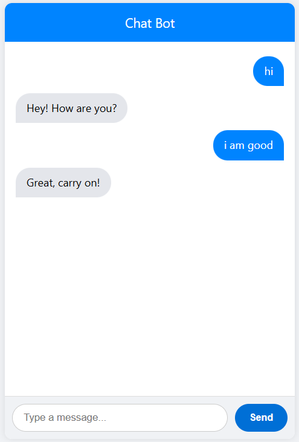

# 🤖 Chatbot 

{ width=50% }

---

## 🚀 Features

- ✅ Intelligent chatbot using Rasa NLU & Core
- 🌐 Flask web interface with integrated chat UI
- 💬 Real-time conversation using `socket.io`
- 🔧 Custom action support
- 📁 Clean and modular project structure

---

## 🧠 Tech Stack

| Tool     | Purpose                          |
|----------|----------------------------------|
| Rasa     | NLP & Dialogue Management        |
| Flask    | Lightweight Web Server           |
| HTML/CSS | Frontend Chat UI                 |
| Rasa Webchat | JS Widget for Chatbot UI     |

---

## 📁 Project Structure

```bash
rasa_flask_chatbot/
├── app/                      # Flask App
│   ├── static/               # CSS, JS, images (if needed)
│   ├── templates/
│   │   └── index.html        # Chat UI using Rasa Webchat
│   └── app.py                # Flask server
│
├── backend/                  # Rasa Project
│   ├── actions/              # Custom actions
│   │   └── actions.py
│   ├── data/                 # NLU data, stories, rules
│   ├── domain.yml            # Intents, entities, responses, slots
│   ├── config.yml            # NLP pipeline and policies
│   ├── credentials.yml       # Channels (webchat, REST, etc.)
│   ├── endpoints.yml         # Action server and tracker store
│   └── models/               # Trained Rasa models
│
├── run_rasa.sh
├── .gitignore               # Shell script to run Rasa server
├── run_actions.sh            # Script to run action server
├── requirements.txt          # Python dependencies
└── README.md

